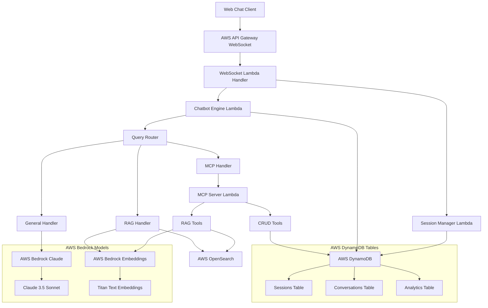

# Design Document

## Overview

The websocket-based chatbot system consists of three main components using entirely AWS services:
1. **AWS API Gateway WebSocket API**: Handles real-time client connections and message routing
2. **AWS Lambda Chatbot Engine**: Processes different types of queries (RAG, general, MCP tools) using AWS Bedrock Claude models
3. **AWS Lambda MCP Server**: Provides RAG and CRUD tools for extended functionality using AWS Bedrock embeddings, AWS OpenSearch, and AWS DynamoDB

The system uses AWS Bedrock for AI model interactions, AWS OpenSearch for vector search, AWS DynamoDB for persistent storage of conversations, analytics, and session management. Session cleanup is handled automatically for inactive users using AWS Lambda scheduled functions.

## Architecture



## Components and Interfaces

### AWS API Gateway WebSocket API + Lambda Handler
- **Technology**: AWS API Gateway WebSocket API with AWS Lambda (Node.js) and AWS SDK
- **Responsibilities**:
  - Handle websocket connections and disconnections via API Gateway
  - Route messages to chatbot engine Lambda functions
  - Manage session lifecycle using AWS DynamoDB
  - Send responses back to clients through API Gateway
  - Initialize AWS SDK for Bedrock AI model interactions

**Interface**:
```typescript
interface WebSocketMessage {
  sessionId: string;
  messageId: string;
  content: string;
  timestamp: string;
  messageType: 'user' | 'system';
}

interface WebSocketResponse {
  sessionId: string;
  messageId: string;
  content: string;
  timestamp: string;
  sources?: string[];
  toolsUsed?: string[];
}
```

### Session Manager (AWS Lambda)
- **Technology**: AWS Lambda (Python) with AWS DynamoDB and AWS EventBridge
- **Responsibilities**:
  - Create and manage session IDs using AWS DynamoDB
  - Track session activity with DynamoDB TTL
  - Implement automatic cleanup for inactive sessions using AWS EventBridge scheduled rules
  - Store session metadata in AWS DynamoDB

**Interface**:
```typescript
interface SessionManager {
  createSession(): Promise<string>;
  getSession(sessionId: string): Promise<Session | null>;
  updateActivity(sessionId: string): Promise<void>;
  cleanupInactiveSessions(): Promise<void>;
}

interface Session {
  sessionId: string;
  createdAt: string;
  lastActivity: string;
  isActive: boolean;
  metadata?: Record<string, any>;
}
```

### Chatbot Engine (AWS Lambda)
- **Technology**: AWS Lambda (Python) with AWS Bedrock SDK for AI model interactions
- **Responsibilities**:
  - Route queries to appropriate handlers using AWS Bedrock Claude models
  - Coordinate between different processing modes
  - Maintain conversation context in AWS DynamoDB
  - Log interactions to AWS DynamoDB
  - Manage AWS Bedrock Claude model interactions via AWS SDK

**Interface**:
```typescript
interface ChatbotEngine {
  processMessage(sessionId: string, message: string): Promise<ChatbotResponse>;
  determineQueryType(message: string): QueryType;
}

enum QueryType {
  RAG = 'rag',
  GENERAL = 'general',
  MCP_TOOL = 'mcp_tool'
}

interface ChatbotResponse {
  content: string;
  sources?: string[];
  toolsUsed?: string[];
  queryType: QueryType;
}
```

### RAG Handler (AWS Lambda)
- **Technology**: AWS Lambda (Python) with AWS Bedrock for AI interactions, AWS OpenSearch for vector search
- **Responsibilities**:
  - Perform vector search on document collection using AWS OpenSearch
  - Generate embeddings using AWS Bedrock Titan Text Embeddings
  - Retrieve relevant document chunks using AWS OpenSearch vector search
  - Generate responses using AWS Bedrock Claude models with retrieved context

**Interface**:
```typescript
interface RAGHandler {
  searchDocuments(query: string): Promise<DocumentChunk[]>;
  generateResponse(query: string, context: DocumentChunk[]): Promise<string>;
}

interface DocumentChunk {
  id: string;
  content: string;
  source: string;
  score: number;
}
```

### MCP Handler (AWS Lambda)
- **Technology**: AWS Lambda (Python) with MCP protocol for tool communication, AWS Bedrock for AI processing
- **Responsibilities**:
  - Identify required MCP tools from user queries using AWS Bedrock Claude models
  - Execute MCP tools with proper parameters via MCP protocol on AWS Lambda
  - Process tool results and generate responses using AWS Bedrock Claude models

**Interface**:
```typescript
import { MCPClient } from '@modelcontextprotocol/sdk';
import { BedrockRuntimeClient } from '@aws-sdk/client-bedrock-runtime';

interface MCPHandler {
  mcpClient: MCPClient;
  bedrockClient: BedrockRuntimeClient;
  identifyTools(query: string): Promise<string[]>;
  executeTool(toolName: string, parameters: Record<string, any>): Promise<any>;
  processToolResults(results: any[]): Promise<string>;
}
```

### MCP Server (AWS Lambda)
- **Technology**: AWS Lambda (Python) with MCP SDK and OpenAPI schema validation, AWS Bedrock, AWS OpenSearch, AWS DynamoDB
- **Tools Provided**:
  - RAG tools for document search and retrieval using AWS Bedrock embeddings and AWS OpenSearch with OpenAPI schema
  - CRUD tools for AWS DynamoDB data management operations with OpenAPI schema

**OpenAPI Schema Structure**:
```yaml
# mcp_tools_schema.yaml
openapi: 3.0.0
info:
  title: Chatbot MCP Tools
  version: 1.0.0
paths:
  /search_documents:
    post:
      summary: Search documents using vector similarity
      requestBody:
        required: true
        content:
          application/json:
            schema:
              type: object
              properties:
                query:
                  type: string
                  description: Search query text
                limit:
                  type: integer
                  default: 5
                  minimum: 1
                  maximum: 20
      responses:
        '200':
          description: Search results
          content:
            application/json:
              schema:
                type: array
                items:
                  type: object
                  properties:
                    id: {type: string}
                    content: {type: string}
                    source: {type: string}
                    score: {type: number}
```

**Interface**:
```python
from typing import Dict, List, Any
import yaml
import jsonschema
import boto3
from botocore.exceptions import ClientError

class MCPServer:
    def __init__(self):
        self.dynamodb = boto3.resource('dynamodb')
        self.bedrock = boto3.client('bedrock-runtime')
        self.opensearch = boto3.client('opensearchserverless')
        self.load_openapi_schema()
        self.available_tools = self.initialize_tools()
    
    def load_openapi_schema(self):
        """Load OpenAPI schema for tool validation"""
        with open('mcp_tools_schema.yaml', 'r') as f:
            self.schema = yaml.safe_load(f)
    
    def validate_input(self, tool_name: str, data: Dict[str, Any]) -> bool:
        """Validate input against OpenAPI schema"""
        schema_path = f"/paths/{tool_name}/post/requestBody/content/application/json/schema"
        tool_schema = self._get_schema_by_path(schema_path)
        jsonschema.validate(data, tool_schema)
        return True
    
    async def search_documents(self, query: str, limit: int = 5, threshold: float = 0.7) -> List[Dict[str, Any]]:
        """RAG tool for document search using AWS Bedrock embeddings and AWS OpenSearch"""
        self.validate_input("search_documents", {"query": query, "limit": limit, "threshold": threshold})
        
        # Generate embedding using AWS Bedrock Titan
        query_embedding = await self._generate_embedding_bedrock(query)
        
        # Search using AWS OpenSearch
        results = await self._search_opensearch(query_embedding, limit, threshold)
        return results
    
    async def create_record(self, table: str, data: Dict[str, Any]) -> Dict[str, Any]:
        """CRUD tool for creating records in AWS DynamoDB with OpenAPI validation"""
        self.validate_input("create_record", {"table": table, "data": data})
        
        table_name = self._get_table_name(table)
        dynamodb_table = self.dynamodb.Table(table_name)
        
        # Add metadata
        import uuid
        from datetime import datetime
        if 'id' not in data:
            data['id'] = str(uuid.uuid4())
        data['created_at'] = datetime.utcnow().isoformat()
        
        # Put item in DynamoDB
        response = dynamodb_table.put_item(Item=data)
        return {'success': True, 'record_id': data['id'], 'data': data}
    
    async def read_record(self, table: str, record_id: str) -> Dict[str, Any]:
        """CRUD tool for reading records from AWS DynamoDB with OpenAPI validation"""
        self.validate_input("read_record", {"table": table, "record_id": record_id})
        
        table_name = self._get_table_name(table)
        dynamodb_table = self.dynamodb.Table(table_name)
        
        response = dynamodb_table.get_item(Key={'id': record_id})
        if 'Item' not in response:
            raise Exception(f"Record {record_id} not found")
        
        return {'success': True, 'data': response['Item']}
    
    async def update_record(self, table: str, record_id: str, data: Dict[str, Any]) -> Dict[str, Any]:
        """CRUD tool for updating records in AWS DynamoDB with OpenAPI validation"""
        self.validate_input("update_record", {"table": table, "record_id": record_id, "data": data})
        
        table_name = self._get_table_name(table)
        dynamodb_table = self.dynamodb.Table(table_name)
        
        # Add updated timestamp
        from datetime import datetime
        data['updated_at'] = datetime.utcnow().isoformat()
        
        # Build update expression for DynamoDB
        update_expression = "SET "
        expression_attribute_values = {}
        for key, value in data.items():
            if key != 'id':
                update_expression += f"{key} = :{key}, "
                expression_attribute_values[f":{key}"] = value
        
        update_expression = update_expression.rstrip(', ')
        
        response = dynamodb_table.update_item(
            Key={'id': record_id},
            UpdateExpression=update_expression,
            ExpressionAttributeValues=expression_attribute_values,
            ReturnValues='ALL_NEW'
        )
        
        return {'success': True, 'data': response['Attributes']}
    
    async def delete_record(self, table: str, record_id: str) -> Dict[str, Any]:
        """CRUD tool for deleting records from AWS DynamoDB with OpenAPI validation"""
        self.validate_input("delete_record", {"table": table, "record_id": record_id})
        
        table_name = self._get_table_name(table)
        dynamodb_table = self.dynamodb.Table(table_name)
        
        response = dynamodb_table.delete_item(
            Key={'id': record_id},
            ReturnValues='ALL_OLD'
        )
        
        if 'Attributes' not in response:
            raise Exception(f"Record {record_id} not found")
        
        return {'success': True, 'message': f"Record {record_id} deleted successfully"}
    
    async def _generate_embedding_bedrock(self, text: str) -> List[float]:
        """Generate text embedding using AWS Bedrock Titan"""
        model_id = "amazon.titan-embed-text-v1"
        
        body = json.dumps({"inputText": text})
        
        response = self.bedrock.invoke_model(
            modelId=model_id,
            body=body,
            contentType="application/json",
            accept="application/json"
        )
        
        response_body = json.loads(response['body'].read())
        return response_body.get('embedding', [])
    
    async def _search_opensearch(self, query_embedding: List[float], limit: int, threshold: float) -> List[Dict[str, Any]]:
        """Search documents using AWS OpenSearch vector search"""
        # Implementation would use AWS OpenSearch vector search capabilities
        # This is a simplified example
        search_body = {
            "query": {
                "knn": {
                    "embedding": {
                        "vector": query_embedding,
                        "k": limit
                    }
                }
            },
            "min_score": threshold
        }
        
        # In real implementation, would call OpenSearch API
        # For now, return mock results
        return []
    
    def _get_table_name(self, table_alias: str) -> str:
        """Get actual DynamoDB table name from alias"""
        table_mapping = {
            'sessions': os.environ.get('SESSIONS_TABLE', 'chatbot-sessions'),
            'conversations': os.environ.get('CONVERSATIONS_TABLE', 'chatbot-conversations'),
            'analytics': os.environ.get('ANALYTICS_TABLE', 'chatbot-analytics')
        }
        return table_mapping.get(table_alias, table_alias)
```

## Data Models

### DynamoDB Tables

#### Sessions Table
```typescript
interface SessionRecord {
  sessionId: string;        // Partition Key
  createdAt: string;        // ISO timestamp
  lastActivity: string;     // ISO timestamp
  isActive: boolean;
  clientInfo?: {
    userAgent: string;
    ipAddress: string;
  };
  ttl: number;             // TTL for automatic cleanup
}
```

#### Conversations Table
```typescript
interface ConversationRecord {
  sessionId: string;        // Partition Key
  messageId: string;        // Sort Key
  timestamp: string;        // ISO timestamp
  messageType: 'user' | 'assistant';
  content: string;
  queryType?: QueryType;
  sources?: string[];
  toolsUsed?: string[];
  responseTime?: number;    // milliseconds
}
```

#### Analytics Table
```typescript
interface AnalyticsRecord {
  date: string;            // Partition Key (YYYY-MM-DD)
  eventId: string;         // Sort Key
  eventType: 'query' | 'tool_usage' | 'session_created' | 'session_closed';
  sessionId: string;
  details: Record<string, any>;
  timestamp: string;
}
```

## Error Handling

### Error Types
```typescript
class ChatbotError extends Error {
  constructor(message: string, public code: string) {
    super(message);
  }
}

class SessionNotFoundError extends ChatbotError {
  constructor(sessionId: string) {
    super(`Session ${sessionId} not found`, 'SESSION_NOT_FOUND');
  }
}

class ModelUnavailableError extends ChatbotError {
  constructor() {
    super('Language model is currently unavailable', 'MODEL_UNAVAILABLE');
  }
}

class MCPToolError extends ChatbotError {
  constructor(toolName: string, message: string) {
    super(`MCP tool ${toolName} failed: ${message}`, 'MCP_TOOL_ERROR');
  }
}
```

### Error Handling Strategy
1. **Graceful Degradation**: If Claude Sonnet 4.5 is unavailable, return a friendly error message
2. **Retry Logic**: Implement exponential backoff for transient failures
3. **Logging**: All errors are logged with context for debugging
4. **User-Friendly Messages**: Technical errors are translated to user-friendly messages

## Testing Strategy

### Unit Tests
- Test individual components in isolation
- Mock external dependencies (DynamoDB, Claude API, MCP tools)
- Test error handling scenarios
- Validate input/output formats

### Integration Tests
- Test websocket connection handling
- Test end-to-end message flow
- Test session management lifecycle
- Test MCP tool integration

### Load Tests
- Test concurrent websocket connections
- Test message throughput
- Test session cleanup under load
- Test DynamoDB performance

### Test Structure
```
tests/
├── unit/
│   ├── session_manager.test.ts
│   ├── chatbot_engine.test.ts
│   ├── rag_handler.test.ts
│   └── mcp_handler.test.ts
├── integration/
│   ├── websocket_flow.test.ts
│   ├── session_lifecycle.test.ts
│   └── mcp_integration.test.ts
└── load/
    ├── concurrent_connections.test.ts
    └── message_throughput.test.ts
```

## Configuration

### Environment Variables
```typescript
interface Config {
  // AWS Configuration
  AWS_REGION: string;
  SESSION_TIMEOUT_MINUTES: number;
  
  // AWS Bedrock Configuration
  BEDROCK_REGION: string;
  BEDROCK_CLAUDE_MODEL: string; // "anthropic.claude-3-5-sonnet-20241022-v2:0"
  BEDROCK_EMBEDDING_MODEL: string; // "amazon.titan-embed-text-v1"
  
  // AWS DynamoDB Configuration
  SESSIONS_TABLE: string;
  CONVERSATIONS_TABLE: string;
  ANALYTICS_TABLE: string;
  
  // AWS OpenSearch Configuration
  OPENSEARCH_ENDPOINT: string;
  OPENSEARCH_INDEX: string;
  OPENSEARCH_REGION: string;
  
  // MCP Configuration
  MCP_SERVER_LAMBDA_ARN: string;
  MCP_TRANSPORT: string; // "lambda" | "stdio"
  
  // AWS API Gateway Configuration
  WEBSOCKET_API_ENDPOINT: string;
  WEBSOCKET_STAGE: string;
}
```

## Deployment Architecture

### AWS CDK Deployment (Python)
The entire system will be deployed using AWS CDK with Python, enabling infrastructure as code and easy deployment with `cdk deploy`.

#### CDK Stack Structure
```
cdk/
├── app.py                    # CDK app entry point
├── stacks/
│   ├── __init__.py
│   ├── chatbot_stack.py      # Main chatbot infrastructure
│   ├── database_stack.py     # DynamoDB tables
│   ├── lambda_stack.py       # Lambda functions
│   └── api_stack.py          # API Gateway and WebSocket API
├── constructs/
│   ├── __init__.py
│   ├── websocket_api.py      # WebSocket API construct
│   └── mcp_server.py         # MCP server construct
└── requirements.txt          # CDK dependencies
```

#### AWS Resources
- **AWS API Gateway WebSocket API**: For websocket connections
- **AWS Lambda Functions**: 
  - WebSocket handler (Node.js with AWS SDK for Bedrock)
  - MCP server (Python with MCP SDK and AWS SDK)
  - Session cleanup (Python with AWS SDK)
  - Chatbot engine (Python with AWS SDK for Bedrock)
- **AWS DynamoDB Tables**: Sessions, Conversations, Analytics
- **AWS OpenSearch Serverless**: Vector search for RAG functionality
- **AWS Bedrock**: Claude models and Titan embeddings
- **AWS IAM Roles**: Proper permissions for Lambda functions to access Bedrock, DynamoDB, OpenSearch
- **AWS CloudWatch**: Logging and monitoring
- **AWS EventBridge**: Scheduled session cleanup

#### CDK Stack Configuration
```python
from aws_cdk import (
    Stack,
    aws_lambda as _lambda,
    aws_apigatewayv2 as apigwv2,
    aws_dynamodb as dynamodb,
    aws_iam as iam,
    aws_secretsmanager as secretsmanager,
    Duration
)

class ChatbotStack(Stack):
    def __init__(self, scope, construct_id, **kwargs):
        super().__init__(scope, construct_id, **kwargs)
        
        # DynamoDB Tables
        self.sessions_table = self.create_sessions_table()
        self.conversations_table = self.create_conversations_table()
        self.analytics_table = self.create_analytics_table()
        
        # Lambda Functions with OpenAPI schema assets
        self.websocket_handler = self.create_websocket_handler()
        self.mcp_server = self.create_mcp_server_with_schema()
        self.session_cleanup = self.create_session_cleanup()
        
        # WebSocket API
        self.websocket_api = self.create_websocket_api()
    
    def create_mcp_server_with_schema(self):
        """Create MCP server Lambda with OpenAPI schema bundled and AWS service access"""
        mcp_role = iam.Role(
            self, "MCPServerRole",
            assumed_by=iam.ServicePrincipal("lambda.amazonaws.com"),
            managed_policies=[
                iam.ManagedPolicy.from_aws_managed_policy_name("service-role/AWSLambdaBasicExecutionRole")
            ],
            inline_policies={
                "BedrockAccess": iam.PolicyDocument(
                    statements=[
                        iam.PolicyStatement(
                            actions=["bedrock:InvokeModel"],
                            resources=["*"]
                        )
                    ]
                ),
                "DynamoDBAccess": iam.PolicyDocument(
                    statements=[
                        iam.PolicyStatement(
                            actions=["dynamodb:GetItem", "dynamodb:PutItem", "dynamodb:UpdateItem", "dynamodb:DeleteItem"],
                            resources=[
                                self.sessions_table.table_arn,
                                self.conversations_table.table_arn,
                                self.analytics_table.table_arn
                            ]
                        )
                    ]
                ),
                "OpenSearchAccess": iam.PolicyDocument(
                    statements=[
                        iam.PolicyStatement(
                            actions=["aoss:APIAccessAll"],
                            resources=["*"]
                        )
                    ]
                )
            }
        )
        
        return _lambda.Function(
            self, "MCPServer",
            runtime=_lambda.Runtime.PYTHON_3_11,
            handler="mcp_server.handler",
            role=mcp_role,
            code=_lambda.Code.from_asset("lambda/mcp_server", 
                bundling={
                    "image": _lambda.Runtime.PYTHON_3_11.bundling_image,
                    "command": [
                        "bash", "-c",
                        "pip install -r requirements.txt -t /asset-output && "
                        "cp -au . /asset-output && "
                        "cp mcp_tools_schema.yaml /asset-output/"
                    ]
                }
            ),
            environment={
                "SCHEMA_PATH": "/var/task/mcp_tools_schema.yaml",
                "SESSIONS_TABLE": self.sessions_table.table_name,
                "CONVERSATIONS_TABLE": self.conversations_table.table_name,
                "ANALYTICS_TABLE": self.analytics_table.table_name,
                "BEDROCK_REGION": self.region,
                "OPENSEARCH_ENDPOINT": self.opensearch_collection.collection_endpoint
            },
            timeout=Duration.minutes(5)
        )
```

### Deployment Commands
```bash
# Install CDK dependencies
pip install -r cdk/requirements.txt

# Bootstrap CDK (first time only)
cdk bootstrap

# Deploy the entire stack
cdk deploy

# Deploy specific stack
cdk deploy ChatbotStack

# Destroy resources
cdk destroy
```

### Environment Configuration
CDK will manage environment variables through:
- **Lambda Environment Variables**: For AWS service configuration (table names, regions, endpoints)
- **IAM Roles**: For AWS service permissions (Bedrock, DynamoDB, OpenSearch access)
- **Parameter Store**: For shared configuration values (model names, timeouts)

### Clean Code Standards
Following the guidelines.txt format:
- **Naming**: camelCase for variables/functions, UPPERCASE_SNAKE_CASE for constants
- **Type Annotations**: All functions include proper type hints
- **Imports**: Organized in standard library, third-party, local application groups
- **Exception Handling**: Specific exceptions before generic ones
- **Logging**: Structured logging with appropriate levels
- **Function Organization**: Utility functions grouped in dedicated modules
- **Line Length**: Maximum 79 characters per line